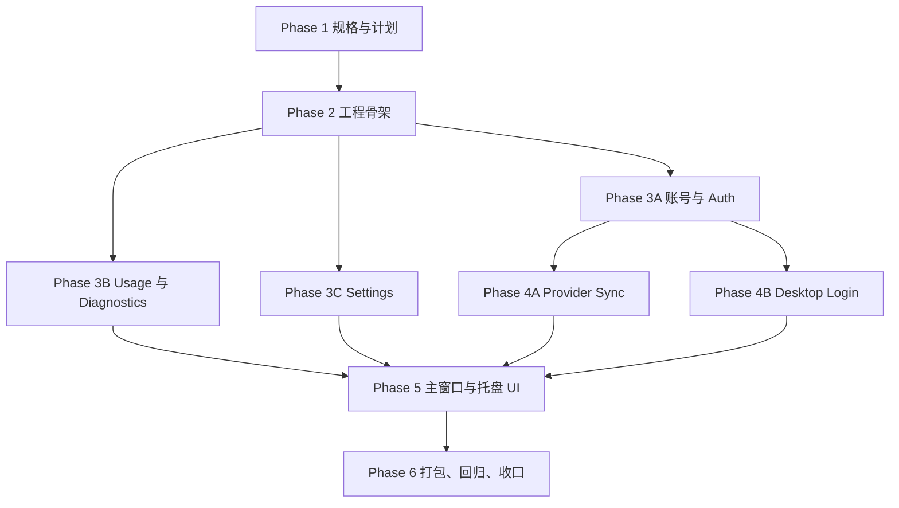

# Codex Switch Tauri 重构依赖图

```mermaid
flowchart TD
    P1["Phase 1 规格与计划"] --> P2["Phase 2 工程骨架"]
    P2 --> P3A["Phase 3A 账号与 Auth"]
    P2 --> P3B["Phase 3B Usage 与 Diagnostics"]
    P2 --> P3C["Phase 3C Settings"]
    P3A --> P4A["Phase 4A Provider Sync"]
    P3A --> P4B["Phase 4B Desktop Login"]
    P3B --> P5["Phase 5 主窗口与托盘 UI"]
    P3C --> P5
    P4A --> P5
    P4B --> P5
    P5 --> P6["Phase 6 打包、回归、收口"]
```
